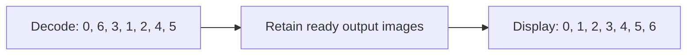

# 1. Validate input and distinguish picture orders

The first useful boundary is between an encoded file and the requirements it
places on a decoder. This player reads the MP4 before selecting a GPU. That
lets device selection use the stream's actual H.264 profile rather than an
assumed profile.

## Trace the input

[`VideoPlayer.prepare`](../../video_player.v#L421) calls
[`Decoder.parse_mp4_data`](../../mp4_parser.v#L141). The parser finds an H.264
track, checks its timescale and samples, reads SPS and PPS data, and records
picture dimensions, profile, timing, references, and display metadata. MP4
gives sample offsets and durations; H.264 headers give codec rules such as
picture order count (POC) and reference status. The parser rejects unsupported
formats before Vulkan session creation. This matters for errors as well as
efficiency: an invalid file should not leave a half-created GPU decoder.

The implementation also checks file size and reads at absolute sample offsets
through [`read_callback`](../../mp4_parser.v#L17). Tests cover
[non-MP4 input](../../video_player_test.v#L258),
[truncation](../../video_player_test.v#L297), and
[short reads](../../video_player_test.v#L277). In another project, input
could instead be a network segment or a camera stream. The boundary remains
useful: turn untrusted bytes into validated stream requirements before asking
the device to allocate resources.

## Two orders, two jobs

H.264 B-pictures can be displayed before a reference picture that must be
decoded first. The bundled 360p fixture starts with decode-order pictures
whose display orders are `0, 6, 3, 1, 2, 4, 5`. A loop that displays each
picture immediately after decoding would show jumps in time.

[`parse_mp4_data`](../../mp4_parser.v#L525) assigns a display order to each
picture while preserving decode order for the decoder. The DPB retains
reference pictures for the codec; the output-image queue retains decoded
pictures waiting for presentation. Those are different lifetimes. The
[`presentation_buffer_size`](../../video_player.v#L262) calculation looks at the
stream's display-order sequence to bound the waiting queue. The fixture-based
tests assert the [early sequence](../../video_player_test.v#L238) and
[required queue depth](../../playback_timeline_test.v#L59).

An H.264 MMCO 5 picture resets reference-picture numbering after it is decoded.
The parser [detects the operation](../../mp4_parser.v#L79) and
[starts a new display-order group](../../mp4_parser.v#L110), while retaining
the picture's original count for the decode command. The
[ordering test](../../video_player_test.v#L50) covers a reset followed by a
picture-order-count wrap. This separation matters whenever a codec resets its
reference state without starting a new file or decoder session.

**Invariant:** decode input advances in codec order; presentation advances
only when the next display-order picture is ready. The next display-order
number does not have to equal the current decode index.

## Apply the boundary elsewhere

| Input design | Useful when | Work it adds |
| --- | --- | --- |
| Parse the complete local file first, as here | A short or seekable file can be scanned before playback. | Startup scanning and metadata memory. |
| Incremental parser and bounded reorder queue | Live or long-form streaming. | Backpressure, incomplete access units, format changes, and recovery from dropped data. |
| External demux and codec library | Broad container or codec support matters more than direct control of the Vulkan path. | A second API and explicit ownership of decoded frames and timestamps. |

For a streaming player, do not copy this file parser wholesale. Keep the
contract it demonstrates: parsed access units carry enough information to
select a compatible decoder, retain references, schedule presentation, and
report malformed input without corrupting GPU state.
