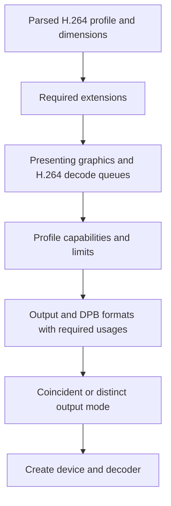

# 2. Select a device from the video's requirements

“Supports Vulkan” is too broad a device test. A player needs a graphics queue
that can present to its window, an H.264 decode queue, the Vulkan Video
extensions, a compatible profile and picture layout, and usable image formats.
The chosen MP4 may require a profile that another file does not.

## The selection path

After parsing, [`VideoDecodeApp.initialize`](../../app.v#L179) obtains the stream's
profile and asks [`h264_decode_gpu_diagnostics_for_output_mode`](../../device_context.v#L409)
for diagnostics for every GPU. [`--list-gpus`](../../app.v#L182) exposes those
diagnostics to the user. A forced [`--gpu` index](../../app.v#L197) is checked
against the same requirements; otherwise the first
compatible device is chosen. Errors name the missing capability instead of
assuming that a graphics-capable GPU can decode.

[`initialize_device`](../../device_context.v#L150) then chooses queue families and
creates the logical device with the required extensions. It builds a
[VideoProfileInfoKHR](../../device_context.v#L267) for progressive 8-bit 4:2:0 H.264 and chains H.264
profile and capability structs through `pNext`. Vulkan Video format queries
use the same profile. A format is useful only if it supports the image usages
required by the next step, including transfer out of the decoded picture in
this design.

The player accepts the two advertised DPB/output modes. In *coincident* mode,
the decoded output is a DPB image. In *distinct* mode, the output and DPB
images are separate. `auto` prefers coincident and falls back to distinct;
forced modes aid driver validation and fail if unsupported. The choice is made
by [`select_decode_output_mode`](../../video_player.v#L17), with software tests
for [automatic fallback](../../video_player_test.v#L23) and
[forced modes](../../video_player_test.v#L28).

**Invariant:** the profile and image usage used for capability queries must
match the resources later created. A successful generic Vulkan device
creation is not proof that a video session or its images will work.

## Apply the selection pattern elsewhere

Build a requirement record from the content first: codec, profile, bit depth,
chroma, coded extent, and any presentation requirements. Probe candidates
against that record. For an editor handling many clips, the policy might be
“choose one device that handles every clip” or “select a backend per clip.” For
a game that uses video only for optional cutscenes, software decode could be
a fallback. Each policy changes when and how compatibility failures should
be reported.

The application has one window and chooses one GPU. Multi-GPU transfer,
software fallback, and runtime format changes are outside its current design.
See [platform support](../../PLATFORM_SUPPORT.md) before treating a successful
build as playback support.
