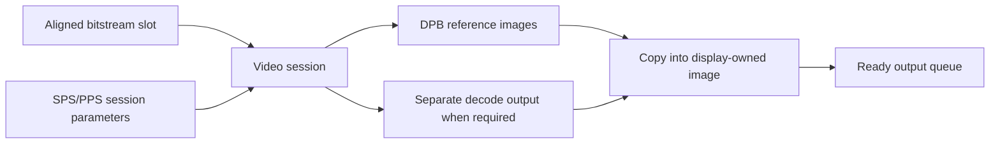

# 3. Give codec references and display images separate lifetimes

Vulkan Video makes the application describe and own resources that a
high-level media API might hide. The important design question is which
resource belongs to the codec, which belongs to presentation, and what must
remain valid while commands are in flight.

## Build the session from parsed limits

[`Decoder.initialize`](../../decoder_session.v#L8) asks the device for H.264
capabilities and supported formats. It checks the parsed DPB slot and active
reference counts against device limits. It allocates an aligned bitstream
buffer, [creates a `VideoSessionKHR`](../../decoder_session.v#L119), queries its opaque memory requirements,
binds that memory, and creates session parameters from SPS/PPS data. The
alignment used for each upload slot comes from the queried minimum bitstream
offset and size alignments. [`write_video_frame`](../../player_decode.v#L540) fills
one slot with the next access unit and its slice offsets.

The DPB stores reference pictures for later H.264 predictions. A picture that
is no longer needed as a reference may free a DPB slot even if its display
time has not arrived. Conversely, a displayed picture may still be referenced
by later decode operations. This is why the app copies decode results into a
separate bounded pool of [`OutputImage`](../../video_player.v#L180) objects,
[allocated after decoder setup](../../video_player.v#L535). The
graphics side samples that pool, not a DPB slot whose codec lifetime it does
not control.

After recording an MMCO 5 picture, the player
[drops older reference slots and renumbers the current one](../../player_decode.v#L148).
The [DPB helper](../../video_player.v#L168) changes reference state only after
the decode command has captured the references needed for that picture.
The [slot list](../../video_player.v#L150) models sliding-window references
and MMCO 5 resets. A player that accepts other explicit MMCO operations or
long-term references also needs to track their reference marking rules.

In coincident mode, the copy source is the current DPB image. In distinct
mode, the copy source is a separate decode-output image; the DPB remains
reference storage. [`copy_decoded_frame_to_output`](../../player_decode.v#L200)
selects the correct source and restores its decode layout after the copy.

**Invariant:** a DPB slot cannot be overwritten while the codec still needs
it, and an output image cannot be reused while graphics may still sample it.
Those rules are related but have different owners.

## Other ownership choices

| Choice | Where it can fit | Constraint |
| --- | --- | --- |
| Copy to a separate display pool, as here | A compact player that wants an explicit presentation queue and simple sampling ownership. | Extra image memory and a per-picture copy. |
| Share decoded images directly with rendering | A pipeline whose decoder and renderer can coordinate image lifetime precisely. | Reference, display, queue, and descriptor lifetimes must all be tracked together. |
| Use a higher-level decoder API | Broad codec support or faster integration. | Less direct control of Vulkan Video session setup and possibly an interop copy. |

For another project, calculate the bound from reorder depth, concurrent
uploads, and frames still sampled by graphics. A fixed pool is safe only if
the producer pauses when no image is reusable. Here
[`VideoPlayer.update`](../../player_presentation.v#L127) checks the free pool before
starting another decode.
