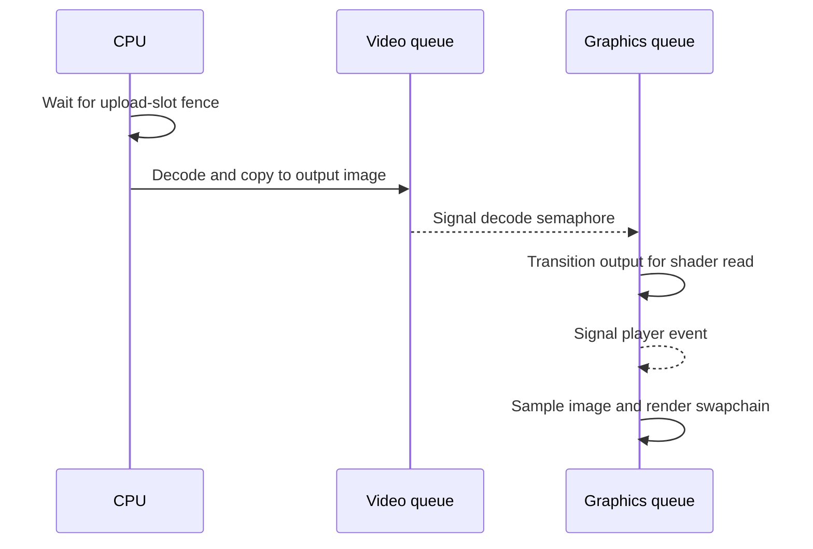

# 4. Make queue order and image reuse explicit

Video decode and graphics may use different Vulkan queues. Recording commands
in source order does not, by itself, make data visible across queues. This
chapter follows the synchronization path and the output-image reuse rule.

## Follow one submission

[`update_decode_video`](../../player_decode.v#L81) waits on the fence for the
bitstream upload slot it is about to reuse, then writes and flushes the encoded
bytes. It records the video command buffer: prepare image layouts, begin and
perform decode, copy the result to an output image, and restore the source
for later decode use. The output image is tagged with display order and placed
in the ready queue.

[`VideoPlayer.update`](../../player_presentation.v#L156) submits that command buffer on
the video queue and signals a semaphore. It then submits a graphics command
buffer that waits on the semaphore and transitions the copied image for
fragment sampling. The app's render command buffer waits for the player's
event before drawing from the selected output view. The swapchain also has
its own [acquire](../../app.v#L373) and
[render-complete](../../app.v#L463) semaphores, managed in
[`VideoDecodeApp.run`](../../app.v#L355).

Image barriers in [`video_decode_pre_barrier`](../../player_decode.v#L340) and
[`copy_decoded_frame_to_output`](../../player_decode.v#L187) describe access and
layout transitions. The semaphore orders work between queues. These solve
different problems: a layout name alone does not wait for a prior queue's
writes, and a semaphore alone does not describe the next image layout.

## Retire rather than immediately recycle

Presentation may replace the current output view while an earlier graphics
submission still samples it. [`retire_current_output`](../../player_presentation.v#L29)
marks that image for later reuse; [`reclaim_output_textures`](../../player_presentation.v#L14)
returns it to the free pool only after enough later render submissions have
begun. This design relies on the app's one fence per swapchain image and
ordered graphics submissions. [Resize](../../app.v#L485) waits for the device to become idle
before rebuilding swapchain-dependent resources.

**Invariant:** neither a mapped bitstream region nor an output image is
reused until the submissions that consume it are complete. Preserve this rule
if you change the number of frames in flight or introduce another queue.

## Alternatives for another renderer

A timeline semaphore can attach explicit completion values to frames and
make image retirement independent of a fixed swapchain image count. A render
graph can own barriers and resource lifetimes if it models video decode and
cross-queue dependencies. A single-queue design can simplify ordering on
devices that support the required operations together, but it still needs
correct image access and layout transitions. Pick one completion model and
make every reusable resource refer to it; mixing an old frame-count heuristic
with a new submission scheme invites premature reuse.
