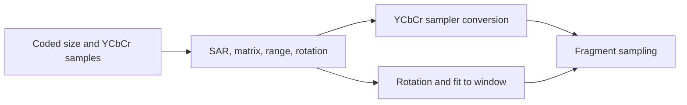

# 5. Turn decoded pictures into correctly displayed frames

Correct decode is only part of playback. Pictures need a display-order gate,
a media clock, color conversion, and a transform that respects pixel aspect
ratio and rotation metadata.

## Display order and time

[`VideoPlayer.update_presentation`](../../player_presentation.v#L72) asks for the next
display-order image. It initially waits until enough reordered pictures are
ready; then it advances only when the current duration is due and that next
image exists. At end of stream it keeps the final picture visible while the
next loop's early pictures are decoded. It resets decoder reference state for
the next cycle rather than showing pictures in decode order.

[`PlaybackTimeline`](../../playback_timeline.v#L10) accumulates elapsed nanoseconds,
subtracts a picture's duration when the picture is presented, and caps a long
stall at 500 ms. Its tests cover [fixed](../../playback_timeline_test.v#L3)
and [variable](../../playback_timeline_test.v#L15) rates,
[missing next pictures](../../playback_timeline_test.v#L39),
[stalls](../../playback_timeline_test.v#L28), and
[reset](../../playback_timeline_test.v#L50). A project requiring
audio sync would need an explicit master clock and a policy for late pictures;
this player has no audio path.

**Invariant:** a picture's duration is consumed when it is presented, not
merely when the wall clock passes it. Otherwise a temporarily missing
reordered image can cause a burst of frames when it arrives.

## Color and geometry are media data

[`parse_mp4_data`](../../mp4_parser.v#L193) stores the track matrix and
[H.264 video usability metadata](../../mp4_parser.v#L246).
[`ycbcr_model_for_video`](../../device_context.v#L295)
chooses a Vulkan YCbCr model from signaled matrix coefficients, with a
resolution-based fallback when no description is present. The Vulkan sampler
conversion uses the video's full or limited range. The app draws into an
[`UNORM swapchain`](../../app.v#L220) so display-encoded YCbCr conversion is
not encoded as sRGB a second time.

[`video_render_transform`](../../app.v#L91) applies quarter-turn rotation and
letterboxing based on display dimensions. Those dimensions incorporate sample
aspect ratio before rotation. The picture can therefore have a coded width,
a display width, and a window width that differ. Tests cover
[track matrices](../../video_player_test.v#L95),
[sample aspect ratio](../../video_player_test.v#L102),
[conversion choices](../../video_player_test.v#L132), and
[portrait letterboxing](../../video_player_test.v#L358).

## Adaptation choices

For an editor, preserve source timestamps and expose a seek clock instead of
looping automatically. For live video, decide whether latency or every
picture matters more: a late picture might be dropped, but a referenced
picture may still need decoding. For HDR or wide-gamut material, a simple
UNORM output and the current matrix mapping are insufficient; the project
needs an explicit transfer-function, gamut, and display pipeline. Those are
product decisions layered on top of the same separation between decode
order, media time, and presentation.
