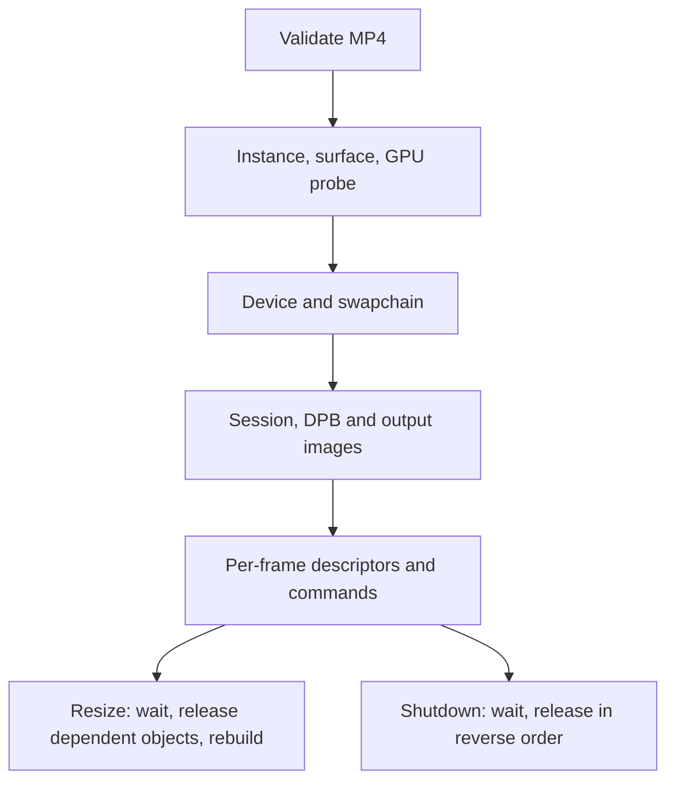

# 6. Own the lifecycle and test the right boundary

The player creates resources in layers. Input validation comes before GPU
selection; instance and surface come before presentation checks; the logical
device comes before session, images, and descriptors. Shutdown follows those
dependencies in reverse. Resize rebuilds resources tied to the swapchain
without reparsing the MP4.

## Trace ownership

[`main`](../../main.v#L71) owns the `VideoDecodeApp` lifetime.
[`VideoDecodeApp.initialize`](../../app.v#L147) creates the window, instance,
surface, compatible device, swapchain, descriptors, pipeline, ImGui backend,
and player resources. [`VideoDecodeApp.run`](../../app.v#L367) handles out-of-date
swapchain results and calls [`recreate_swapchain`](../../app.v#L504), which waits
for idle, releases per-frame resources, resizes, and recreates the dependent
resources. [`shutdown`](../../app.v#L553) waits for the device, releases player and
graphics resources, then destroys the device, window, and GLFW state.

Input and capability failures during initialization use
[`abort_initialization`](../../app.v#L606) and close the input file. Later Vulkan
allocation or submission failures can still be fatal; the repository does not
claim to recover from every partial GPU initialization. The precise support
boundary is in [Supported media and failure behavior](../../PLATFORM_SUPPORT.md#supported-media-and-failure-behavior).

## What the checks establish

| Check | What it establishes | What it cannot establish |
| --- | --- | --- |
| [`v test .`](../../README.md#tests) | CLI parsing, MP4 and parameter-set validation, multi-slice access units, metadata, reorder depth, and timeline rules. | Driver video commands, image barriers, or visible output. |
| [Root executable build](../../BUILDING.md#shared-dear-imgui-default) | V/C bindings, native linking, and package entry point. | Compatible hardware or correct playback. |
| [`--list-gpus VIDEO`](../../README.md#run) | The current driver advertises the required capabilities for that stream. | That a full decode and resize session succeeds. |
| [Playback and resize on a supported GPU](../../PLATFORM_SUPPORT.md#hardware-validation-checklist) | The tested media and driver complete the actual path. | Other codecs, GPUs, operating systems, or long-running stability. |

The [README](../../README.md#tests) has the software command;
[Platform Support](../../PLATFORM_SUPPORT.md) has the hardware matrix, and the
[hardware checklist](../../PLATFORM_SUPPORT.md#hardware-validation-checklist)
lists release checks. A useful development loop is to run software tests for
every parser or timing change, then use short media fixtures with B-frames,
rotation, and different color metadata on an actual decode-capable GPU.
The [four-slice fixture](../../res/README.md#test-media) exercises access-unit
assembly and picture-consistency checks; its
[parser test](../../video_player_test.v#L504) runs without a GPU.
The [reference-marking conformance streams](../../PLATFORM_SUPPORT.md#hardware-validation-checklist)
exercise MMCO 5 and long-term operations on real hardware after remuxing to
MP4. The optional [NV12 readback](../../frame_readback.v#L48) and
[comparison script](../../scripts/compare_nv12.py#L25) test decoded bytes
against FFmpeg in display order. This exposed custom H.264 scaling lists
whose values were lost by the pinned parser; the player now
[populates those lists](../../h264_parameter_sets.v#L77), and a
[software test](../../video_player_test.v#L695) covers SPS and PPS examples.
The four Linux GPU comparisons in
[Platform Support](../../PLATFORM_SUPPORT.md#supported-media-and-failure-behavior)
matched byte for byte. A clean validation-layer run checks API use; pixel
comparison checks those decoded streams on the tested GPU. Neither establishes
correctness on all drivers or in the final color-converted window image.

## Transfer the approach

Keep a testable media clock and parser separate from hardware submission.
Record which failures can be returned cleanly and which still abort. When
adding seeking, stream changes, audio, or multiple windows, draw a new
resource-lifetime diagram first: each feature adds a new point at which a
buffer, reference picture, or display image may still be in use.
