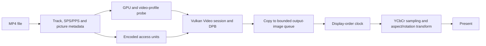

# Design guide: building a Vulkan Video player

This guide uses `v_vulkan_video` to explain decisions that recur in media and
GPU projects: validating input before choosing a device, retaining codec
references while presenting in a different order, coordinating queues, and
owning resources across resize and shutdown. It is for readers who know basic
V and Vulkan graphics but are new to Vulkan Video. The code is an application,
not a reusable player library.

The implementation plays progressive 8-bit 4:2:0 H.264/AVC in MP4. It is one
design for one codec and container. The alternatives in this guide describe
possible designs for other projects, not features already implemented here.
Start with the [README](../README.md#run) to run the player, or the
[Quick Start](../QUICKSTART.md) to set up a build.

## System map

An *access unit* is the encoded data for one picture. The *decoded picture
buffer* (DPB) retains pictures that later pictures may reference. *Decode
order* is the order the codec needs; *display order* is the order viewers see.
An *output image* here is a separate image copied from the decode result and
kept until the graphics queue has finished sampling it.

H.264 *sequence parameter sets* (SPS) and *picture parameter sets* (PPS)
describe decoding rules for a stream and its pictures. *Picture order count*
(POC) helps reconstruct display order. *YCbCr* represents luma and chroma
components; the renderer converts them to display color while sampling.

The application enters at [`main`](../main.v#L71). The drawing loop is
[`VideoDecodeApp.run`](../app.v#L367), and GPU selection is in
[`find_h264_decode_gpu_for_output_mode`](../device_context.v#L511).
[`parse_mp4_data`](../mp4_parser.v#L252) reads the input,
[`update_decode_video`](../player_decode.v#L7) records decode work, and
[`update_presentation`](../player_presentation.v#L73) manages output images.
[`PlaybackTimeline`](../playback_timeline.v#L10) tracks media time. These are
source file responsibilities within one V package, not public modules.

## Read by decision

| Chapter | Question to take to another project |
| --- | --- |
| [1. Input and picture order](guide/01-input-and-order.md) | What must be known about the stream before allocation, and why can decode and display order differ? |
| [2. Device and format selection](guide/02-capabilities.md) | How should an application turn actual media requirements into a device choice? |
| [3. Decode resources](guide/03-decode-resources.md) | Which images and buffers does a decoder own, and how do the supported output modes change them? |
| [4. Queues and image lifetime](guide/04-synchronization.md) | When is a decoded image safe to copy, sample, and reuse? |
| [5. Presentation and metadata](guide/05-presentation.md) | How do picture order, media time, color, rotation, and window size become a displayed frame? |
| [6. Lifecycle and verification](guide/06-lifecycle-and-verification.md) | Which checks prove parser behavior, and which still require real hardware? |

Each chapter traces the implementation, states an invariant, and compares
alternatives. The code links are navigation aids; the explanation should make
the idea understandable without reading every Vulkan call.

## A route through one picture

1. [`prepare`](../video_player.v#L576) calls the
   [MP4 parser](../mp4_parser.v#L252), which rejects unsupported streams.
   Its profile and dimensions inform GPU selection.
2. [`initialize_device`](../device_context.v#L154) selects graphics and H.264
   decode queues, queries the video profile, and chooses a compatible format.
3. [`Decoder.initialize`](../decoder_session.v#L8) creates the session,
   bitstream buffer, and DPB images. [`VideoPlayer.initialize`](../video_player.v#L623)
   allocates the bounded output-image pool.
4. [`update_decode_video`](../player_decode.v#L7) uploads an access unit, records
   decode and copy commands, and tags the copied output with display order.
5. [`update_presentation`](../player_presentation.v#L73) chooses the next display-order
   image when its duration is due. [`VideoDecodeApp.run`](../app.v#L367) samples it
   and presents the swapchain image.

The [queue submission trace](guide/04-synchronization.md#follow-one-submission)
explains why these steps cannot be collapsed into a simple “decode, then draw”
call on every device.

## Evidence and limits

[`v test .`](../README.md#tests) exercises parser, ordering, timing, CLI, and
metadata rules without requiring a Vulkan Video GPU. It does not execute
video commands or prove cross-queue synchronization. See
[tested platforms](../PLATFORM_SUPPORT.md) and the
[hardware checklist](../PLATFORM_SUPPORT.md#hardware-validation-checklist).
When adapting the design, repeat those checks with the codec,
driver, devices, and media that your product actually supports.
